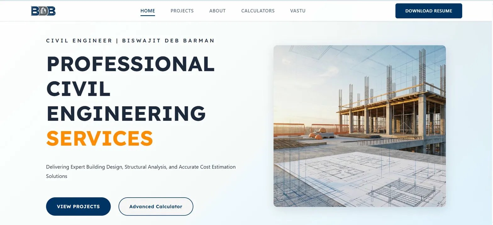
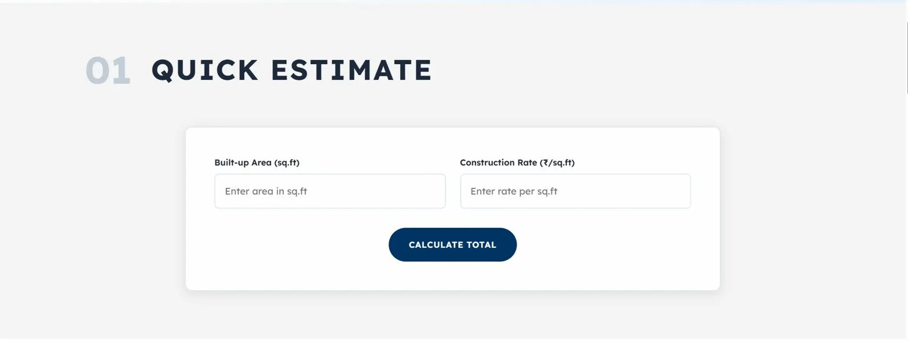
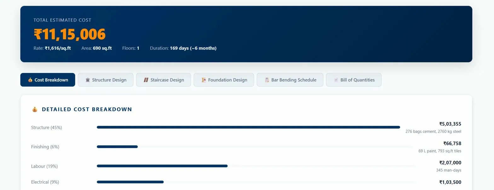
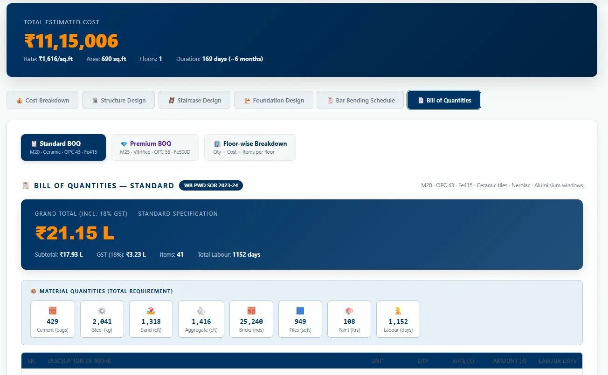

# 🏗️ Portfolio of Er. Biswajit Deb Barman

> **Civil Engineer & Structural Designer** — Professional Portfolio Website with Advanced Construction Calculators

[](https://reactjs.org/)
[](https://create-react-app.dev/)
[](https://developer.mozilla.org/en-US/docs/Web/CSS)
[](https://developer.mozilla.org/en-US/docs/Web/JavaScript)
[](https://reactrouter.com/)
[](https://engineer-biswajit.netlify.app/)

---

## 📋 Table of Contents

- [Overview](#-overview)
- [Live Demo](#-live-demo)
- [Screenshots](#-screenshots)
- [Features](#-features)
- [Project Structure](#-project-structure)
- [Calculator Modules](#-calculator-modules)
- [Technology Stack](#-technology-stack)
- [Component Architecture](#-component-architecture)
- [Installation & Setup](#-installation--setup)
- [Available Scripts](#-available-scripts)
- [Configuration](#-configuration)
- [Styling Architecture](#-styling-architecture)
- [Build & Deployment](#-build--deployment)
- [Project Stats](#-project-stats)
- [Future Enhancements](#-future-enhancements)
- [License](#-license)
- [Author](#-author)

---

## 🎯 Overview

A modern, fully responsive portfolio website for **Er. Biswajit Deb Barman**, a Civil Engineer specializing in structural design, cost estimation, and architectural planning. The centrepiece of the site is an advanced **multi-module construction calculator** covering everything from RCC slab design to a full IS 456:2000-compliant Bill of Quantities (BOQ) with WB PWD Schedule of Rates — a real engineering toolkit built into a portfolio.

---

## 🌐 Live Demo

### 🔗 [https://engineer-biswajit.netlify.app/](https://engineer-biswajit.netlify.app/)

---

## 📸 Screenshots

### 🏠 Home — Hero Section


---

### ⚡ Quick Estimate Calculator


---

### 🧮 Construction Calculator Suite


---

### 🏡 Vastu Room Planner


---

### 📐 Building Specifications Input


---

### 💰 Detailed Cost Breakdown


---

### 📋 Bill of Quantities (BOQ) — WB PWD SOR 2023–24


---

## ✨ Features

### Site-Wide
- 📱 **Fully Responsive** — optimized for desktop, tablet, and mobile
- 🎨 **Modern UI/UX** — clean, professional interface with smooth animations
- ✨ **Shimmer/Mirror Effects** — interactive hover effects on all cards
- 🔄 **AOS Scroll Animations** — fade, slide, and stagger effects
- 🚀 **Optimized Performance** — lazy-loaded images, tree-shaken bundles

### Pages
- **Home** — Hero, skills showcase, featured projects, services, about preview
- **Projects** — Filterable gallery (All / Residential / Commercial) with modal details
- **About** — Skills grid, education timeline, certifications, contact card, CV download
- **Calculators** — 8 advanced structural & costing calculation modules (see below)
- **Vastu** — Vastu Room Planner (plot-spec-based layout) + Vastu Study (principles & remedies)

---

## 📁 Project Structure

```
biswajit-portfolio-react/
│
├── public/
│   ├── assets/
│   │   ├── icons/              # Logo and favicon
│   │   ├── images/
│   │   │   ├── hero/           # Hero section images
│   │   │   └── projects/       # Project screenshots
│   │   └── files/
│   │       └── Biswajit_Deb_Barman__CV.pdf
│   └── index.html
│
├── src/
│   ├── components/             # Shared reusable components
│   │   ├── layout/
│   │   │   ├── Navbar.jsx
│   │   │   └── Footer.jsx
│   │   ├── modals/
│   │   │   └── ProjectModal.jsx
│   │   └── ui/
│   │       ├── ProjectCard.jsx
│   │       ├── ServiceCard.jsx
│   │       ├── SkillCard.jsx
│   │       └── EducationItem.jsx
│   │
│   ├── config/
│   │   ├── calculatorConstants.js   # All engineering constants & default rates
│   │   ├── index.js
│   │   ├── wbPwdRatesPremium.js     # WB PWD premium schedule of rates
│   │   └── wbPwdRatesStandard.js    # WB PWD standard schedule of rates
│   │
│   ├── data/                        # Static site content
│   │   ├── education.js
│   │   ├── projects.js
│   │   ├── services.js
│   │   └── skills.js
│   │
│   ├── hooks/                       # Custom React hooks (one per calculator module)
│   │   ├── useBeamDesign.js
│   │   ├── useBrickMasonry.js
│   │   ├── useColumnDesign.js
│   │   ├── useCostingInputs.js
│   │   ├── usePaintEstimator.js
│   │   └── useSlabDesign.js
│   │
│   ├── pages/
│   │   ├── AboutPage/
│   │   ├── CalculatorPage/
│   │   │   ├── calculator/          # Core calculation engines
│   │   │   ├── components/
│   │   │   │   └── tabs/            # One tab component per module
│   │   │   │       ├── BeamDesignTab.jsx
│   │   │   │       ├── BrickMasonryTab.jsx
│   │   │   │       ├── ColumnDesignTab.jsx
│   │   │   │       ├── CostingInputPanel.jsx
│   │   │   │       ├── CostingResults.jsx
│   │   │   │       ├── FullBOQTab.jsx
│   │   │   │       ├── HeroSection.jsx
│   │   │   │       ├── PaintEstimatorTab.jsx
│   │   │   │       ├── SlabDesignTab.jsx
│   │   │   │       └── StructuralDesignTab.jsx
│   │   │   ├── config/
│   │   │   ├── hooks/
│   │   │   ├── styles/
│   │   │   │   ├── CalculatorPage.css
│   │   │   │   └── design-calculator-styles.css
│   │   │   ├── utils/
│   │   │   └── CalculatorPage.jsx
│   │   ├── HomePage/
│   │   ├── ProjectPage/
│   │   └── VastuPage/
│   │
│   ├── styles/                      # Global CSS architecture
│   │   ├── base/
│   │   │   ├── reset.css
│   │   │   └── variables.css
│   │   └── components/
│   │
│   ├── App.jsx
│   └── index.js
│
├── package.json
└── README.md
```

---

## 🧮 Calculator Modules

The Calculator Page is the flagship feature — a professional-grade engineering toolkit with **8 independent modules**, each backed by its own custom React hook and calculation engine. All structural modules are **IS 456:2000 compliant**.

### 1. ⚡ Quick Estimate
Instant construction cost estimate by entering built-up area and construction rate per sq.ft.

### 2. 🧱 Building Cost Estimator (Estimate Costing)
Detailed construction cost estimation for RCC-framed buildings.
- Input: length, breadth, floor height, number of floors (G to G+4), building type, finish grade, soil condition, region
- Calculates: structure, finishing, labour, electrical, plumbing, and contingency costs
- Sub-results: Cost Breakdown · Structure Design · Staircase Design · Foundation Design · Bar Bending Schedule · Bill of Quantities

### 3. 📋 Bill of Quantities (BOQ)
Full BOQ using **WB PWD Schedule of Rates 2023–24**.
- Standard BOQ: M20 · OPC 43 · Fe415 · Ceramic tiles · Nerolac · Aluminium windows
- Premium BOQ: M25 · OPC 53 · Fe500D · Vitrified tiles
- Floor-wise Breakdown: qty + cost + items per floor
- Covers 41 line items with material quantities, labour days, and GST (18%)
- Material summary: cement (bags), steel (kg), sand (cft), aggregate (cft), bricks, tiles, paint, labour days

### 4. 🏠 RCC Slab Design
Designs reinforced concrete slabs per IS 456:2000.
- Input: slab dimensions, grade of concrete, support conditions
- Outputs: effective depth, reinforcement spacing, concrete volume

### 5. 🏛️ Beam Design
RCC beam design for rectangular and flanged beams.
- Input: span, load, grade of concrete and steel
- Outputs: required cross-section, main steel area, shear stirrups

### 6. 🏗️ Column Design
Axially and eccentrically loaded column design.
- Input: column dimensions, axial load, slenderness ratio
- Outputs: longitudinal steel area, lateral tie spacing

### 7. 🧱 Brick Masonry Calculator
Estimates brick and mortar quantities for masonry walls.
- Input: wall length, height, thickness, brick size
- Outputs: number of bricks, mortar volume, cement & sand quantities

### 8. 🎨 Paint Estimator
Calculates paint quantity and cost for interior/exterior surfaces.
- Input: room dimensions or total area, number of coats
- Outputs: paint quantity in litres, primer requirement, total cost

---

## 🛠 Technology Stack

| Technology | Purpose | Version |
|---|---|---|
| **React** | UI framework | 18.x |
| **React Router DOM** | Client-side routing | 7.x |
| **JavaScript ES6+** | Programming language | ES2023 |
| **CSS3 (Custom Properties)** | Styling | Modern CSS |
| **Create React App** | Build tooling | 5.x |
| **AOS** | Scroll animations | CDN |
| **Google Fonts** | Typography (Lexend, Poppins) | CDN |

---

## 🧩 Component Architecture

```
App (BrowserRouter)
├── Navbar
└── Routes
    ├── HomePage
    │   ├── HeroSection
    │   ├── SkillCard ×n
    │   ├── ProjectCard ×n
    │   └── ServiceCard ×n
    ├── ProjectsPage
    │   ├── FilterBar
    │   ├── ProjectCard ×n
    │   └── ProjectModal
    ├── AboutPage
    │   ├── SkillCard ×n
    │   ├── EducationItem ×n
    │   └── ContactCard
    ├── CalculatorPage
    │   ├── HeroSection
    │   ├── QuickEstimate
    │   ├── Tab Navigation (8 tabs)
    │   ├── CostingInputPanel / CostingResults
    │   │   ├── Cost Breakdown
    │   │   ├── Structure Design
    │   │   ├── Staircase Design
    │   │   ├── Foundation Design
    │   │   ├── Bar Bending Schedule
    │   │   └── Bill of Quantities (Standard / Premium / Floor-wise)
    │   ├── SlabDesignTab
    │   ├── BeamDesignTab
    │   ├── ColumnDesignTab
    │   ├── BrickMasonryTab
    │   ├── PaintEstimatorTab
    │   └── StructuralDesignTab
    ├── VastuPage
    │   ├── Room Planner (plot-spec → Vastu layout)
    │   └── Vastu Study (principles, directions, colors, remedies)
    └── Footer
```

---

## ⚙️ Configuration

### Site Metadata (`src/config/constants.js`)

```js
export const SITE = {
  name: 'Er. Biswajit Deb Barman',
  title: 'Civil Engineer & Structural Designer',
  email: 'biswajitdebbarman.civil@gmail.com',
  phone: '+91-7602120054',
  location: 'Chanditala, Raiganj, Uttar Dinajpur, West Bengal',
  linkedin: 'https://www.linkedin.com/in/biswajit-deb-barman/',
};
```

### Material Constants (`src/config/calculatorConstants.js`)

```js
// Per sq.ft constants for RCC framed structure
export const MATERIAL_CONSTANTS = {
  cement: 0.4,      // bags/sq.ft
  steel: 4.0,       // kg/sq.ft
  sand: 0.044,      // m³/sq.ft
  aggregate: 0.088, // m³/sq.ft
};

export const DEFAULT_MATERIAL_RATES = {
  cement: 420,      // ₹ per bag
  steel: 65,        // ₹ per kg
  sand: 1500,       // ₹ per m³
  aggregate: 1400,  // ₹ per m³
};

export const FINISHING_RATES = {
  basic: 450,       // ₹/sq.ft
  standard: 750,
  premium: 1200,
};
```

### WB PWD Schedule of Rates
The BOQ module uses actual West Bengal Public Works Department rates:
- `src/config/wbPwdRatesStandard.js` — Standard spec (M20 · OPC 43 · Fe415)
- `src/config/wbPwdRatesPremium.js` — Premium spec (M25 · OPC 53 · Fe500D)

---

## 🎨 Styling Architecture

### CSS Custom Properties (`src/styles/base/variables.css`)

```css
--color-primary:  #003366;   /* Navy blue */
--color-accent:   #FF8C00;   /* Orange */
--color-bg-dark:  #F4F4F4;   /* Light gray */
--color-text:     #1E293B;   /* Dark slate */

--font-display: "Lexend";
--font-body:    "Poppins";

--spacing-xs: 0.5rem;
--spacing-sm: 1rem;
--spacing-md: 2rem;
--spacing-lg: 4rem;
--spacing-xl: 5rem;
```

### Shimmer / Mirror Effect
All interactive cards use a CSS pseudo-element shimmer on hover:
```css
.card::before {
  content: '';
  background: linear-gradient(90deg, transparent, rgba(255,255,255,0.4), transparent);
  /* Animates: left -100% → 100% on hover */
}
```

---

## 📦 Installation & Setup

### Prerequisites
- Node.js >= 14.0.0
- npm >= 6.0.0

### Steps

```bash
# 1. Clone the repo
git clone https://github.com/Mercuri-Biswajit/biswajit-portfolio-react.git
cd biswajit-portfolio-react

# 2. Install dependencies
npm install

# 3. Start dev server
npm start
# Opens http://localhost:3000
```

---

## 📜 Available Scripts

| Script | Description |
|---|---|
| `npm start` | Runs dev server at `localhost:3000` with hot reload |
| `npm test` | Launches Jest test runner |
| `npm run build` | Creates optimized production build in `/build` |
| `npm run eject` | Ejects CRA config (⚠️ irreversible) |

---

## 🚀 Build & Deployment

```bash
npm run build
```

Produces a minified, hashed, production-ready bundle in `/build`. This project is deployed on **Netlify**.

### Deploy to Netlify
```bash
npm install -g netlify-cli
netlify deploy --prod
```

### Deploy to Vercel
```bash
npm install -g vercel
vercel --prod
```

### Deploy to GitHub Pages
```bash
npm install --save-dev gh-pages
# Add to package.json:
# "homepage": "https://mercuri-biswajit.github.io/biswajit-portfolio-react"
npm run deploy
```

---

## 📊 Project Stats

| Metric | Count |
|---|---|
| Pages | 5 (Home, Projects, About, Calculators, Vastu) |
| React Components | 20+ |
| Calculator Modules | 8 |
| Custom React Hooks | 6 |
| BOQ Line Items | 41 |
| CSS Files | 15+ |
| Data Models | 4 (Projects, Skills, Services, Education) |
| Languages | JavaScript 61.8% · CSS 38% · HTML 0.2% |
| Deployed On | Netlify |

---

## 🔮 Future Enhancements

- [ ] PDF export for BOQ and design results
- [ ] Dark mode toggle
- [ ] Contact form with email integration
- [ ] More structural modules (Footing Design, Retaining Wall)
- [ ] Multi-language support (Bengali / Hindi)
- [ ] Progressive Web App (PWA) support
- [ ] Google Analytics integration
- [ ] Client testimonials section

---

## 📄 License

This project is licensed under the **MIT License**.

```
MIT License

Copyright (c) 2026 Er. Biswajit Deb Barman

Permission is hereby granted, free of charge, to any person obtaining a copy
of this software and associated documentation files (the "Software"), to deal
in the Software without restriction, including without limitation the rights
to use, copy, modify, merge, publish, distribute, sublicense, and/or sell
copies of the Software, and to permit persons to whom the Software is
furnished to do so, subject to the following conditions:

The above copyright notice and this permission notice shall be included in all
copies or substantial portions of the Software.

THE SOFTWARE IS PROVIDED "AS IS", WITHOUT WARRANTY OF ANY KIND, EXPRESS OR
IMPLIED, INCLUDING BUT NOT LIMITED TO THE WARRANTIES OF MERCHANTABILITY,
FITNESS FOR A PARTICULAR PURPOSE AND NONINFRINGEMENT. IN NO EVENT SHALL THE
AUTHORS OR COPYRIGHT HOLDERS BE LIABLE FOR ANY CLAIM, DAMAGES OR OTHER
LIABILITY, WHETHER IN AN ACTION OF CONTRACT, TORT OR OTHERWISE, ARISING FROM,
OUT OF OR IN CONNECTION WITH THE SOFTWARE OR THE USE OR OTHER DEALINGS IN THE
SOFTWARE.
```

---

## 👤 Author

**Er. Biswajit Deb Barman**  
Civil Engineer & Structural Designer

| | |
|---|---|
| 📧 Email | biswajitdebbarman.civil@gmail.com |
| 📞 Phone | +91-7602120054 |
| 🌐 Portfolio | [engineer-biswajit.netlify.app](https://engineer-biswajit.netlify.app/) |
| 💼 LinkedIn | [biswajit-deb-barman](https://www.linkedin.com/in/biswajit-deb-barman/) |
| 📸 Instagram | [@biswajit.deb.barman](https://www.instagram.com/biswajit.deb.barman/) |
| 📍 Location | Chanditala, Raiganj, Uttar Dinajpur, West Bengal, India |

---

## 🙏 Acknowledgments

- [Create React App](https://create-react-app.dev/) — Build tooling
- [React Router](https://reactrouter.com/) — Routing
- [AOS](https://michalsnik.github.io/aos/) — Scroll animations
- [Google Fonts](https://fonts.google.com/) — Typography
- West Bengal PWD Schedule of Rates 2023–24 — BOQ rate references

---

**Built with ❤️ by Er. Biswajit Deb Barman** | Last Updated: February 2026